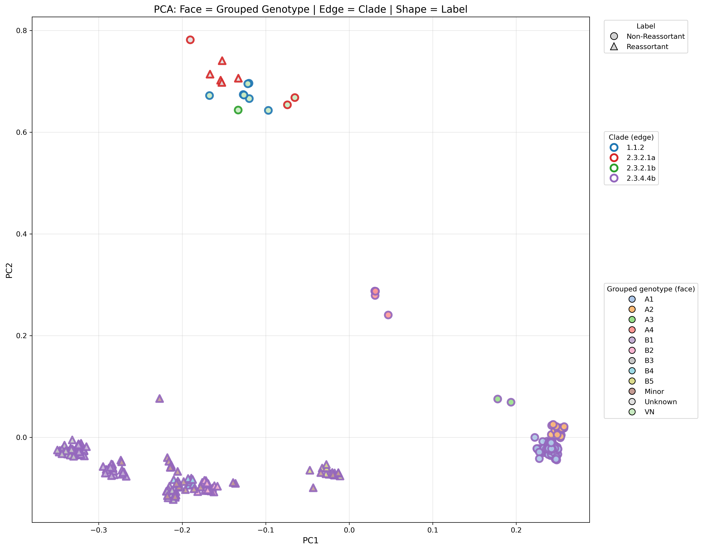

# Results

This folder summarizes the key outputs from the reassortment prediction framework, including DNABERT-2 embedding visualization, Random Forest classifier performance, genetic algorithm recovery of reassortant candidates, and GAT-based segment interaction analysis.

## Embedding Space Analysis

PCA and t-SNE were used to visualize the DNABERT-2-derived segment-specific embeddings from the training dataset.

The PCA projection shows a strong global separation between reassortant and non-reassortant genomes. Non-reassortants form a compact cluster, suggesting that genotype A1 non-reassortant genomes are relatively homogeneous in the learned embedding space. In contrast, reassortants separate into multiple visible subclusters, consistent with the presence of multiple reassortant genotypes and segment-combination patterns.

The t-SNE projection further emphasizes local neighborhood structure. Reassortant genomes remain clearly separated from non-reassortants and show distinct subclusters, supporting the idea that reassortants are not a single uniform group. Non-reassortants appear more spread out in t-SNE than in PCA, which is expected because t-SNE prioritizes local relationships and can expand compact global clusters to reveal finer-scale variation.

Together, PCA and t-SNE provide complementary views: PCA highlights the broad global separation between reassortant and non-reassortant genomes, while t-SNE reveals local structure and within-class heterogeneity. The consistent class-level separation across both methods suggests that DNABERT-2 segment-specific embeddings capture biologically meaningful reassortment-associated genomic patterns without task-specific fine-tuning.

## Random Forest Classifier

The Random Forest classifier achieved strong performance on unseen same-study test data.

| Metric | Result |
|---|---:|
| Test samples | 55 |
| Reassortants correctly identified | 30 / 30 |
| Non-reassortants correctly identified | 25 / 25 |
| Accuracy | 100% |
| Mean prediction confidence | 0.96 |

## External-Study Evaluation

The Random Forest classifier was also evaluated on an independently curated external-study dataset containing **17 non-reassortants** and **5 reassortants** from multiple published H5N1 studies. This evaluation tested how well the model generalized beyond the original same-study test setting.

| Metric | Result |
|---|---:|
| Test samples | 22 |
| Non-reassortants correctly identified | 14 / 17 |
| Reassortants correctly identified | 5 / 5 |
| Accuracy | 86.36% |
| Balanced Accuracy | 91.18% |
| MCC | 0.7174 |

The model correctly identified all reassortant samples in this external-study test set, while 3 non-reassortant samples were misclassified as reassortants. Despite the small and imbalanced dataset, the MCC of 0.7174 indicates useful generalization across independently sourced sequences.

### Multi-Level Embedding Structure

This PCA plot visualizes DNABERT-2 embeddings using three biological metadata layers: shape indicates reassortment status, edge color indicates clade, and face color indicates grouped genotype. The embeddings show clear organization across clade, genotype, and reassortment labels, demonstrating that the learned representations capture multi-level biological structure rather than only a binary class signal.

The separation of external clades from the primary 2.3.4.4b group, together with genotype-level clustering within the same embedding space, suggests that DNABERT-2 segment-specific embeddings encode meaningful evolutionary and reassortment-associated variation.

## Genetic Algorithm Results

Because Influenza A contains eight independently exchangeable genome segments, the number of potential reassortant combinations increases rapidly with the number of parental viruses. The genetic algorithm (GA) module was used to prioritize biologically plausible reassortant candidates from this large combinatorial space.

The GA successfully recovered known reassortant genotype patterns from outbreak data, suggesting that the framework captures biologically meaningful segment compatibility constraints. 

### Genetic Algorithm Fitness Criteria

The genetic algorithm was designed to prioritize biologically plausible reassortant genomes by scoring candidate segment combinations using influenza-specific compatibility rules. Each candidate genome was represented as an 8-segment combination derived from two parental viruses.

The fitness function included the following criteria:

| Fitness criterion | Biological rationale | Fitness contribution |
|---|---|---:|
| Intact polymerase complex | PB2, PB1, and PA were rewarded when inherited from the same parent, reflecting functional compatibility of the influenza polymerase complex. | +100 |
| NP–polymerase compatibility | NP was rewarded when inherited from the same parent as the intact polymerase complex, reflecting the functional association between NP and polymerase activity. | +50 |
| Partial polymerase integrity | Candidates with two of the three polymerase segments from the same parent were given a smaller reward, representing partial compatibility. | +35 |
| HA–NA co-inheritance | HA and NA were rewarded when inherited from the same parent, reflecting coordinated surface protein compatibility. | +40 |
| Avoidance of fully parental genomes | Fully parental segment combinations were penalized to encourage true reassortant candidates rather than unchanged parental genomes. | −70 |

These biologically informed constraints guided the GA toward reassortant candidates that preserve key functional relationships while still exploring novel segment combinations.

## GAT-Based Segment Interaction Analysis

The GAT-based segment interaction analysis was used to examine how segment-level relationships differ between reassortant and non-reassortant genomes. Unlike the Random Forest classifier, which serves as the primary prediction model, the GAT module provides an attention-guided view of segment compatibility patterns learned from the same reassortment classification task.

Each influenza genome was represented as an 8-node graph corresponding to PB2, PB1, PA, HA, NP, NA, MP, and NS. Directed attention weights were extracted from the trained GAT model and summarized to identify high-attention segment–segment relationships. Self-loops were removed only for visualization, so the interaction graphs focus on relationships between different genome segments.

### GAT Evaluation

The GAT model was evaluated on the internal validation set, the same-clade test set, and the other-clade external test set. The model performed strongly within the same-clade setting but did not generalize reliably to the other-clade dataset. Therefore, the attention-derived interaction patterns are interpreted primarily within the same-clade context.

#### Internal Validation Set

| True / Predicted | Non-Reassortant | Reassortant |
|---|---:|---:|
| Non-Reassortant | 24 | 0 |
| Reassortant | 0 | 24 |

| Metric | Value |
|---|---:|
| Accuracy | 1.0000 |
| MCC | 1.0000 |

#### Same-Clade Test Set

| True / Predicted | Non-Reassortant | Reassortant |
|---|---:|---:|
| Non-Reassortant | 25 | 0 |
| Reassortant | 1 | 29 |

| Metric | Value |
|---|---:|
| Accuracy | 0.9818 |
| MCC | 0.9641 |

#### Other-Clade External Test Set

| True / Predicted | Non-Reassortant | Reassortant |
|---|---:|---:|
| Non-Reassortant | 17 | 0 |
| Reassortant | 5 | 0 |

| Metric | Value |
|---|---:|
| Accuracy | 0.7727 |
| MCC | 0.0000 |

The Random Forest classifier generalized better on the cross-clade evaluation set, likely because it operates on the full concatenated DNABERT-2 embedding representation and may capture broader reassortment-associated patterns across the genome. In contrast, the GAT model introduces an explicit graph structure and additional neural-network parameters to learn segment-level interaction patterns. Given the relatively small training set of 239 samples, the GAT appears to have learned a more clade-specific interaction signature rather than a fully generalizable reassortment rule.

Therefore, the GAT attention maps shown below are generated from the same-clade setting, including the internal training, internal validation, and same-clade test data. Cross-clade attention values are not included in these visualizations because the GAT did not generalize reliably to the cross-clade dataset.

### Key Observations from GAT Attention Maps

| Observation | Interpretation |
|---|---|
| NP-related interactions were prominent in both reassortant and non-reassortant genomes. | NP appears to be an important segment in the learned interaction structure. |
| Reassortant genomes showed stronger NP-centered attention signals compared with non-reassortants. | This suggests that NP-associated compatibility changes may be particularly informative for distinguishing reassortant genomes within the same-clade dataset. |
| PB2-related interactions also appeared among the high-attention relationships in reassortants. | This aligns with manual inspection of the segment-combination patterns, where NP appeared frequently involved in reassortment, followed by PB2. |
| Non-reassortant genomes also showed high-attention interactions, including NP- and HA-related patterns, but with lower overall attention intensity. | Non-reassortants showed prominent NP- and HA-associated interactions, while reassortants showed stronger NP- and PB2-associated signals. | This suggests a class-specific shift in the segment relationships emphasized by the GAT model.|
| The GAT model performed strongly on the same-clade test set but failed to identify reassortants in the other-clade test set. | This indicates that the learned attention patterns are likely specific to the same-clade training distribution and should not be interpreted as universal reassortment mechanisms without further validation across diverse clades. |
| The attention maps are consistent with observed segment-combination patterns in the training and same-clade data. | This supports the use of GAT as a segment interaction analysis module, helping reveal biologically plausible compatibility patterns beyond the flat Random Forest embedding-based classifier. |

### Segment Interaction Networks

  
  

  <b>Left:</b> Non-Reassortant Interaction Network &nbsp;&nbsp;&nbsp;
  <b>Right:</b> Reassortant Interaction Network

  Edge colors represent normalized GAT attention strength
  (green = lower attention, red = higher attention). Directed edges indicate attention-guided relationships between genome segments.

The GAT module adds a segment-level interpretation layer to the reassortment prediction framework. While the Random Forest classifier provides robust prediction from concatenated embeddings, GAT attention maps help identify candidate segment–segment compatibility patterns associated with reassortment. The emergence of NP- and PB2-associated interactions provides biologically interpretable hypotheses for downstream analysis, particularly around NP–polymerase compatibility and segment constellation shifts.
